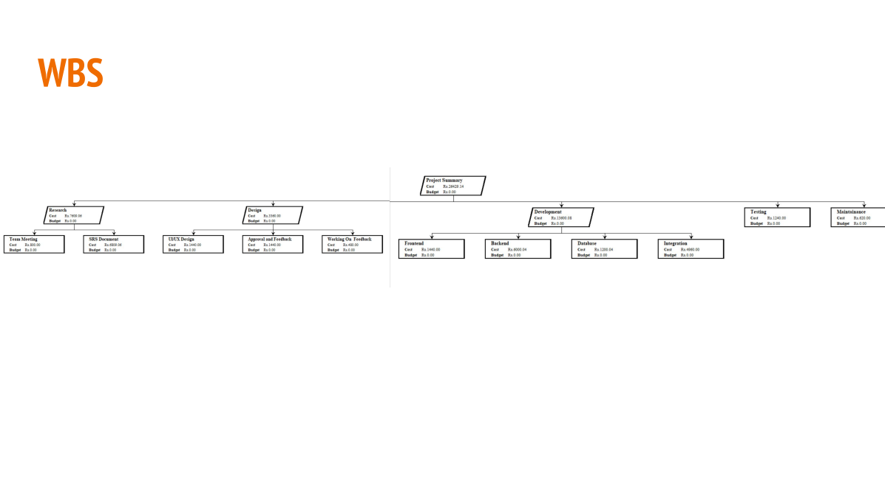
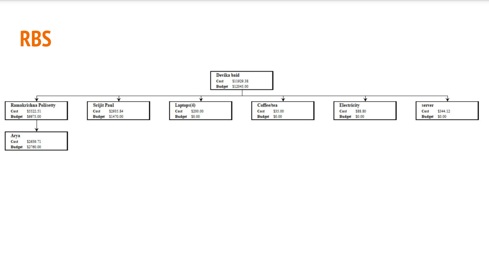

## Contributors

I like to thank the following individuals for their contributions to this project:

- **[Aryan Srivastava](https://github.com/theWorkingPrototype/NO)** 
- **[Srijit_Paul](https://github.com/Srijit-Paul)** 
- **[Devika Baid]** 
- **[Ramakrishna Polisetty]** 

## What is Doodle Classifying System
It is an application to help children and illiterate people(or people not knowing english) learn to write english alphabets and numbers. The application will be user friendly for kids and people with no prior digital experience. It will require minimal supervision required for learning to write. It will also provide parents insight into their child’s learning status and progress.

## How it Works?
Using neural networks the accuracy of 
their hand drawn letter will be compared 
against the data set and the feedback 
shared with them to improve upon. The 
user will know how good a job they did 
and the data of their performance on 
each letter will be stored for parent 
supervision and insight

## Who are the target users?
The primary target audience are 
people learning to write english 
alphabets for the first time and 
have little to no access to guidance 
or supervision in order to improve.

## Product Overview
The application uses neural networks to determine the 
character or number drawn on the canvas. The application 
will give scores on accuracy to the user and thus help them 
learn. The classifier can be used to convert image to text as 
a perfect use case. 

## Project Vision Scope

## Demo WBS

## Demo RBS

## Demo Network Diagram

## Gantt Chart

